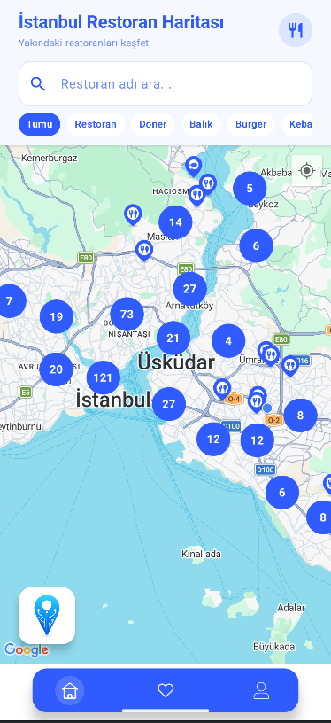
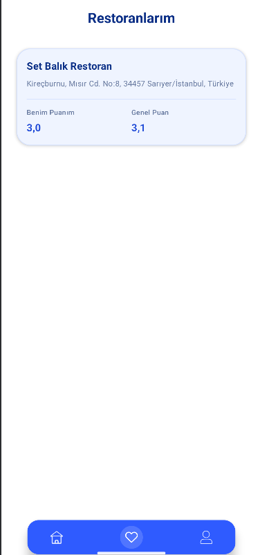
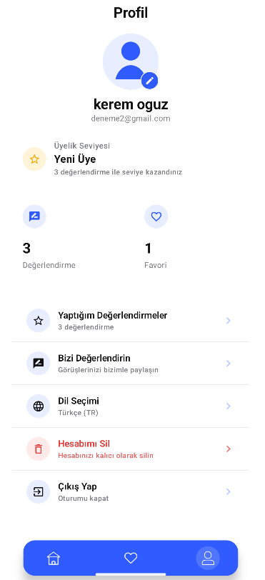
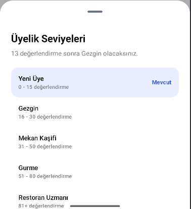
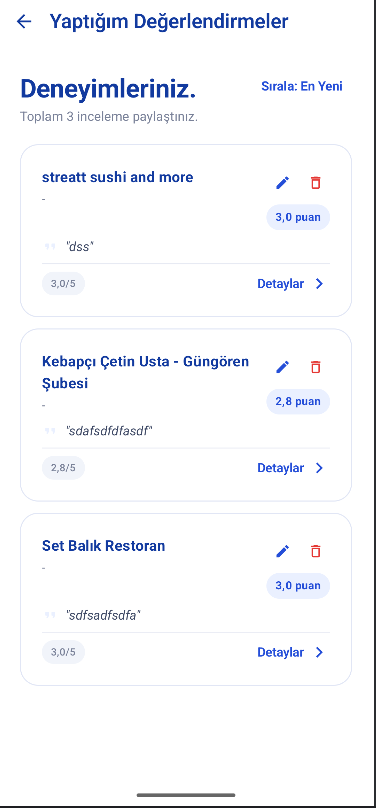
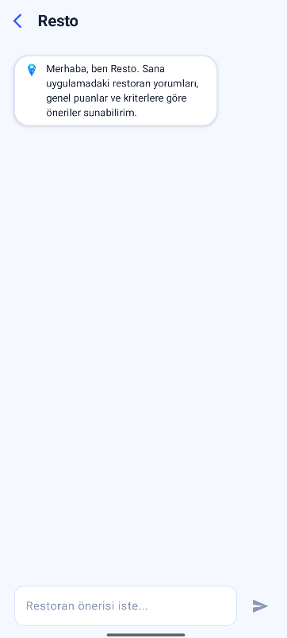

# Nerede Yiyelim? - Yapay Zekâ Destekli Restoran Öneri Uygulaması

Bu proje, kullanıcıların bulundukları konuma göre restoranları harita üzerinde görüntüleyebildiği, restoran detaylarına ulaşabildiği, favorilerine ekleyebildiği, yorum ve puanlama yapabildiği Android tabanlı bir mobil uygulamadır.

Uygulamada kullanıcıya daha uygun restoran önerileri sunmak amacıyla yapay zekâ destekli öneri yapısı kullanılmıştır. Öneri sistemi; kullanıcının konumu, restoran puanları, kategori bilgileri, yorumlar ve restoran uzaklığı gibi verileri dikkate alarak çalışmaktadır.

## Projenin Amacı

Bu projenin amacı, kullanıcıların restoran seçme sürecini kolaylaştırmak ve konuma dayalı daha uygun restoran önerileri sunmaktır. Kullanıcılar uygulama üzerinden yakınındaki restoranları görüntüleyebilir, restoranları inceleyebilir, favorilerine ekleyebilir ve yorum/puanlama işlemleri yapabilir.

## Kullanılan Teknolojiler

* Kotlin
* Android Studio
* Jetpack Compose
* MVVM Mimarisi
* Clean Architecture
* Retrofit
* OkHttp
* Firebase Authentication
* Firebase Firestore
* Google Maps API
* Google Places API
* Gemini AI
* GitHub
* ProGuard / R8

## Temel Özellikler

* Kullanıcı kayıt ve giriş işlemleri
* Harita üzerinde restoranları görüntüleme
* Konuma göre restoran listeleme
* Restoran adına ve kategoriye göre filtreleme
* Restoran detay sayfası
* Favori restoran ekleme ve çıkarma
* Kullanıcı yorumları ve puanlama sistemi
* Üyelik seviyesi görüntüleme
* Kullanıcı profil ekranı
* Yapay zekâ destekli restoran önerileri
* İnternet bağlantısı kontrolü
* Release build için ProGuard / R8 optimizasyonu

## Uygulama Ekranları

### Harita ve Restoran Listeleme Ekranı

Kullanıcılar İstanbul restoran haritası üzerinden yakınındaki restoranları görüntüleyebilir. Restoranlar harita üzerinde marker olarak gösterilir. Ayrıca kategori filtreleri ve restoran adı arama alanı ile kullanıcı istediği restoranları daha kolay bulabilir.



### Favori Restoranlar Ekranı

Kullanıcılar beğendikleri restoranları favorilerine ekleyebilir. Favoriler ekranında restoran adı, adres bilgisi, kullanıcının verdiği puan ve restoranın genel puanı görüntülenir.



### Profil Ekranı

Profil ekranında kullanıcı bilgileri, değerlendirme sayısı, favori sayısı, üyelik seviyesi, dil seçimi, hesap silme ve çıkış yapma gibi işlemler yer almaktadır.



### Üyelik Seviyeleri Ekranı

Kullanıcıların yaptığı değerlendirme sayısına göre üyelik seviyesi gösterilmektedir. Yeni Üye, Gezgin, Mekan Kaşifi, Gurme ve Restoran Uzmanı gibi seviyeler ile kullanıcı deneyimi daha etkileşimli hale getirilmiştir.



### Yaptığım Değerlendirmeler Ekranı

Kullanıcılar daha önce yaptığı restoran değerlendirmelerini bu ekrandan görebilir. Değerlendirmeler üzerinde düzenleme, silme ve detay görüntüleme işlemleri yapılabilir.



### Resto Chatbot Ekranı

Resto chatbot ekranı, kullanıcıdan gelen restoran önerisi isteğini değerlendirerek konum, puan ve restoran bilgilerine göre öneri sunmak amacıyla hazırlanmıştır.



## Proje Mimarisi

Proje MVVM ve Clean Architecture yapısına uygun şekilde geliştirilmiştir.

Genel veri akışı şu şekildedir:

```text
Jetpack Compose Screen
        ↓
ViewModel
        ↓
Repository
        ↓
Firebase / Google Places API / Gemini AI
```

Presentation katmanında kullanıcı arayüzleri ve ViewModel yapıları bulunmaktadır. Domain katmanında uygulama modelleri ve iş kuralları yer almaktadır. Data katmanında ise Firebase, API servisleri, DTO modelleri ve repository implementasyonları bulunmaktadır.

## Öneri Sistemi

Bu projede ayrı bir makine öğrenmesi modeli eğitilmemiştir. Yapay zekâ tarafında Gemini AI kullanılarak kullanıcıya restoran önerileri sunulmuştur.

Öneri sistemi şu verileri dikkate alır:

* Kullanıcının konumu
* Restoranların kullanıcıya olan uzaklığı
* Restoran puanları
* Kategori bilgileri
* Kullanıcı yorumları
* Uygulama içi değerlendirmeler

Genel öneri akışı:

```text
Kullanıcı Konumu
        ↓
Google Places API
        ↓
Yakındaki Restoranlar
        ↓
Puan + Kategori + Yorum + Mesafe
        ↓
Gemini AI / Öneri Sistemi
        ↓
Kullanıcıya Restoran Önerisi
```

## Kurulum ve Çalıştırma

1. Proje Android Studio ile açılır.
2. Gradle Sync işlemi tamamlanır.
3. Firebase bağlantısı için `google-services.json` dosyası `app/` klasörü içinde bulunmalıdır.
4. Google Maps, Google Places ve Gemini AI için gerekli API key bilgileri eklenmelidir.
5. Uygulama emulator veya gerçek Android cihaz üzerinde çalıştırılabilir.

## API Key Bilgileri

Güvenlik nedeniyle API key bilgilerinin doğrudan kod içinde paylaşılmaması önerilir. Projeyi çalıştırmak için gerekli key değerleri `local.properties` dosyası üzerinden tanımlanabilir.

Örnek kullanım:

```properties
MAPS_API_KEY=BURAYA_GOOGLE_MAPS_API_KEY_YAZILACAK
PLACES_API_KEY=BURAYA_GOOGLE_PLACES_API_KEY_YAZILACAK
GEMINI_API_KEY=BURAYA_GEMINI_API_KEY_YAZILACAK
GOOGLE_WEB_CLIENT_ID=BURAYA_GOOGLE_WEB_CLIENT_ID_YAZILACAK
```

## Test Edilen Özellikler

* Kullanıcı giriş ve kayıt işlemleri
* Google Places API üzerinden restoran listeleme
* Google Maps üzerinde restoran gösterimi
* Favorilere ekleme ve çıkarma
* Firestore üzerinden yorum ve puan kaydetme
* Kullanıcı değerlendirmelerini listeleme
* Üyelik seviyesi görüntüleme
* Gemini AI ile restoran önerisi alma
* İnternet bağlantısı durumunun kontrol edilmesi

## Sonuç

Bu proje kapsamında, kullanıcıların restoran seçimini kolaylaştıran konum tabanlı ve yapay zekâ destekli bir Android uygulaması geliştirilmiştir. Uygulama, restoranları yalnızca listelemekle kalmayıp kullanıcı konumu, puan, kategori ve yorum gibi bilgileri kullanarak daha uygun restoran önerileri sunmaktadır.

## Geliştirici

Kerem Oğuz
Öğrenci No: 22040101039
İstanbul Topkapı Üniversitesi
Bilgisayar Mühendisliği
